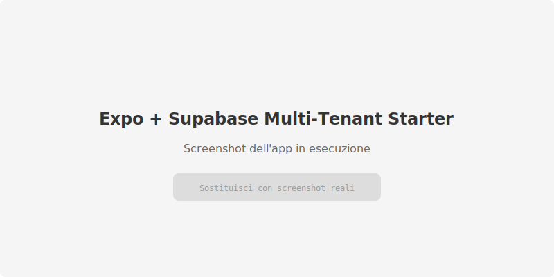

# Expo + Supabase Multi-Tenant SaaS Starter

[](LICENSE)
[](https://expo.dev)
[](https://supabase.com)
[](https://nextjs.org)

Boilerplate open source per costruire SaaS multi-sede/multi-tenant con **Expo** (mobile) + **Supabase**.

> Crea un progetto pubblicabile in giorni, non settimane. Auth multi-ruolo, RLS pronte, onboarding organizzazione, tutto funzionante.

---


<!-- Sostituisci con screenshot reali dell'app in esecuzione -->

---

## Stack

| Livello | Tecnologia |
|---|---|
| Mobile | Expo SDK 52 + Expo Router 4 |
| Web | Next.js 15 (opzionale) |
| Backend | Supabase (Postgres, Auth, RLS, Edge Functions) |
| Linguaggio | TypeScript |
| Monorepo | npm workspaces |
| Lint/Format | ESLint + Prettier + Husky |

## Quick start (5 minuti)

```bash
# 1. Clona
git clone https://github.com/Gabriele06-local/expo-supabase-multitenant-starter.git
cd expo-supabase-multitenant-starter

# 2. Bootstrap automatico (richiede Node.js, Docker, Supabase CLI)
#    Crea .env, installa dipendenze, avvia Supabase, migra, seed, genera tipi
./setup.sh

# 3. Avvia l'app mobile
npm run dev:mobile
```

**Oppure passo per passo:**
```bash
cp .env.example .env.local
npm install
supabase start
npm run db:migrate
npm run db:seed
npm run db:types
npm run dev:mobile
```

## Demo accounts

Dopo aver eseguito `npm run db:seed`, sono disponibili:

| Email | Password | Ruolo | Org |
|---|---|---|---|
| owner@acme.com | password123 | Owner | Acme Corp |
| admin@acme.com | password123 | Admin | Acme Corp |
| staff@acme.com | password123 | Staff (Branch North) | Acme Corp |
| customer@acme.com | password123 | Customer | Acme Corp |
| owner@globex.com | password123 | Owner | Globex Inc |

## Struttura del progetto

```
/
├── apps/
│   ├── mobile/                 → Expo (Router, auth, org switcher, CRUD membri/sedi)
│   │   ├── app/(auth)/         → Login, registrazione
│   │   ├── app/(onboarding)/   → Crea org, accetta invito
│   │   └── app/(app)/          → Dashboard, membri, sedi
│   └── web/                    → Next.js 15 (auth pages, dashboard server)
├── packages/
│   ├── supabase/               → Client Supabase condiviso
│   ├── shared-types/           → Tipi TS (Database, entità, enum)
│   └── shared-ui/              → Componenti RN condivisi (RoleBadge)
├── supabase/
│   ├── migrations/             → 3 migrazioni versionate (schema, RLS, RPC)
│   ├── functions/              → Edge Functions Deno (invite-user, send-notification)
│   ├── seed.sql                → Dati demo realistici
│   └── schema.dbml             → Diagramma ER (per dbdiagram.io)
└── docs/
    ├── ARCHITECTURE.md         → Decisioni architetturali e pattern
    └── CONTRIBUTING.md         → Come contribuire
```

## Comandi npm

| Comando | Descrizione |
|---|---|
| `npm run dev:mobile` | Avvia Expo dev server |
| `npm run dev:web` | Avvia Next.js dev server |
| `npm run lint` | ESLint su tutto il progetto |
| `npm run format` | Prettier formattazione |
| `npm run typecheck` | TypeScript type check |
| `npm run db:start` | Avvia Supabase local stack |
| `npm run db:stop` | Ferma Supabase local stack |
| `npm run db:reset` | Resetta il DB e riesegue seed |
| `npm run db:migrate` | Applica migrazioni |
| `npm run db:seed` | Seed dati demo |
| `npm run db:types` | Genera tipi TS da Supabase |
| `npm run db:studio` | Apre Supabase Studio |
| `npm run functions:serve` | Avvia Edge Functions localmente |
| `npm run setup` | Bootstrap completo |

## Edge Functions

```bash
# Sviluppo locale
npm run functions:serve

# Deploy su Supabase
npm run functions:deploy invite-user
npm run functions:deploy send-notification
```

## EAS Build

```bash
# Development (expo-dev-client)
eas build --profile development --platform all

# Preview (distribuzione interna)
eas build --profile preview --platform all

# Production (App Store / Play Store)
eas build --profile production --platform all
```

Config: `apps/mobile/eas.json`

## Documentazione

- [ARCHITECTURE.md](docs/ARCHITECTURE.md) — Decisioni su schema, RLS, RPC vs Edge Functions
- [CONTRIBUTING.md](docs/CONTRIBUTING.md) — Come contribuire al progetto
- [PLANNING.md](PLANNING.md) — Scope MVP e decisioni iniziali
- [Roadmap](Roadmap%20starter%20kit%20expo%20supabase.md) — Stato avanzamento fasi

## Licenza

MIT — usa, modifica, distribuisci liberamente.
