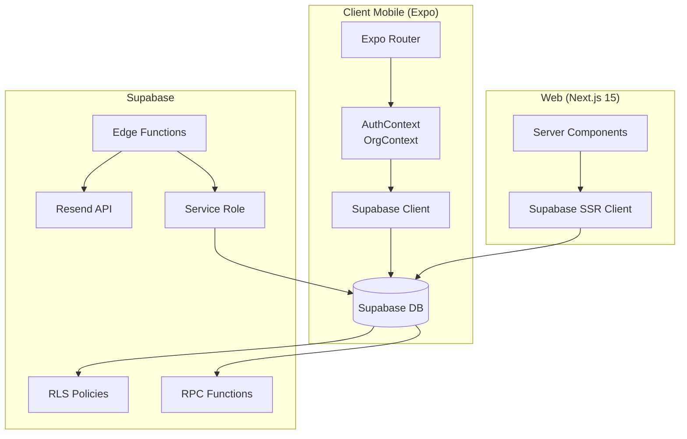

# Architettura — Expo + Supabase Multi-Tenant Starter

## Indice

1. [Schema multi-tenant](#1-schema-multi-tenant)
2. [RLS policies](#2-rls-policies)
3. [RPC vs Edge Function vs query diretta](#3-rpc-vs-edge-function-vs-query-diretta)
4. [Tradeoff e decisioni](#4-tradeoff-e-decisioni)
5. [Diagramma architetturale](#5-diagramma-architetturale)
6. [Come estendere](#6-come-estendere)

---

## 1. Schema multi-tenant

Lo schema segue un modello **organization → locations → users** con permessi granulari:

```
organizations (tenant)
    │
    ├── locations (sedi fisiche/sedi operative)
    │
    └── memberships (utente ↔ org/location ↔ ruolo)
               │
               └── users (auth.users)
```

### Perché questo schema?

- **Separazione netta tra tenant e utente:** un utente può appartenere a più organizzazioni con ruoli diversi.
- **Permessi a due livelli:** ruolo a livello organizzazione (owner, admin) e a livello sede (staff, customer).
- **Inviti disaccoppiati:** la tabella `invites` permette onboarding asincrono senza richiedere registrazione immediata.

### Vincoli chiave

- `memberships.user_org_location_unique` — un utente non può avere due membership identiche per stessa org+sede.
- `invites.token` univoco — garantisce che ogni invito sia singolo e tracciabile.

[Diagramma DBML →](schema.dbml) (visualizzabile su [dbdiagram.io](https://dbdiagram.io))

---

## 2. RLS policies

### Principi guida

1. **Deny by default** — tutte le tabelle hanno RLS abilitato, nessun accesso senza policy esplicita.
2. **Policy basate su memberships** — mai hardcodare `user_id = auth.uid()` per autorizzare accessi. Usa sempre le helper `has_org_role()` e `has_location_role()`.
3. **Separazione CRUD** — ogni operazione (select, insert, update, delete) ha la sua policy con il minimo privilegio necessario.

### Helper functions

```sql
-- Chi è l'utente corrente
auth_user_id()

-- Ha un ruolo (o superiore) a livello organizzazione?
has_org_role(user_id, org_id, min_role)

-- Ha un ruolo (o superiore) a livello sede?
has_location_role(user_id, location_id, min_role)

-- Appartiene almeno a questa org?
belongs_to_org(user_id, org_id)
```

### Gerarchia ruoli

```
owner (4) → admin (3) → staff (2) → customer (1)
```

Le policy usano confronto `<=' per cui un owner ha implicitamente tutti i permessi inferiori.

### Esempio: policy memberships

```sql
-- Un admin può vedere tutti i membri della sua org
create policy "Memberships are visible to org members"
  on public.memberships for select
  using (belongs_to_org(auth_user_id(), organization_id));

-- Solo owner/admin possono promuovere (e non a owner)
create policy "Memberships can be managed by org owners and admins"
  on public.memberships for insert
  with check (has_org_role(auth_user_id(), organization_id, 'admin'));
```

---

## 3. RPC vs Edge Function vs query diretta

Vedi tabella completa e regola pratica nella sezione dedicata qui sotto.

### Tabella riassuntiva

| Criterio | Query + RLS | RPC | Edge Function |
|---|---|---|---|
| Latenza | Bassa | Bassa | Media (cold start) |
| Security context | Utente (anon key) | Utente (anon key) / Definer | Service role |
| Atomicità | Manuale (lato client) | Garantita (SQL tx) | Manuale |
| API esterne | ❌ | ❌ | ✅ |
| Segreti/env vars | ❌ | ❌ | ✅ |
| Costo | Gratuito | Gratuito | CPU/timeout |
| Debugging | Semplice | Medio | Complesso |

### Regola pratica

1. **Inizia sempre con RLS + query diretta.**
2. **Se hai bisogno di atomicità multi-tabella → RPC.**
3. **Se hai bisogno di API esterne o service role → Edge Function.**
4. **Se una Edge Function diventa troppo lenta → valuta RPC per la parte critica.**

---

## 4. Tradeoff e decisioni

### Monorepo con npm workspaces (vs Turborepo)

**Scelto:** npm workspaces semplici.

**Perché:** minore complessità iniziale, zero configurazione aggiuntiva. Turborepo si può aggiungere quando il progetto cresce.

### Expo Router (vs React Navigation standalone)

**Scelto:** Expo Router (file-based routing).

**Perché:** routing condizionato per ruolo è più semplice con gruppi di route (`(auth)`, `(app)`, `(onboarding)`), e la struttura a file rende le route auto-documentanti.

### RLS instead of API middleware

**Scelto:** RLS come layer di autorizzazione primario.

**Perché:** la sicurezza è applicata a livello database, non ci si può dimenticare di controllare i permessi in un controller. Le RLS viaggiano con la migrazione e sono versionate.

### Service role solo in Edge Functions

**Scelto:** la `service_role` key non viene mai usata lato client. Le operazioni che richiedono bypass RLS vanno in Edge Functions deployate separatamente.

### Inviti con token (vs link diretti)

**Scelto:** token generato e salvato in `invites`, accettato via RPC `accept_invite()`.

**Perché:** non richiede configurazione email per funzionare in sviluppo, il token può essere comunicato manualmente. In produzione si integra con Resend per invio automatico.

---

## 5. Diagramma architetturale



---

## 6. Come estendere

### Aggiungere una nuova tabella con RLS

1. Crea una nuova migrazione in `supabase/migrations/00004_<nome>.sql`
2. Definisci la tabella con `organization_id` come FK
3. Abilita RLS: `alter table public.<tabella> enable row level security;`
4. Crea policy usando `belongs_to_org()` o `has_org_role()`
5. Aggiungi il tipo in `packages/shared-types/src/index.ts`
6. Esegui `npm run db:migrate` e `npm run db:types`

### Aggiungere pagamenti (Stripe)

1. Crea una Edge Function `supabase/functions/create-checkout/index.ts`
2. Usa Stripe SDK per creare una sessione di checkout
3. Alla conferma, un webhook Stripe chiama un'altra Edge Function che aggiorna la tabella `subscriptions`
4. Aggiungi tabella `subscriptions` con FK a `organizations`
5. Filtra funzionalità premium basate su `subscriptions.status` via RLS o RPC

### Integrare notifiche push

1. Configura Expo Push Notifications nell'app
2. Crea una tabella `push_tokens` collegata a `user_id`
3. Edge Function `send-notification` → Expo Push API
4. Trigger dopo insert su tabella `notifications`

### Aggiungere una nuova Edge Function

```bash
supabase functions new my-function
# Scrivi la logica in supabase/functions/my-function/index.ts
npm run functions:serve  # test locale
npm run functions:deploy my-function  # deploy
```
